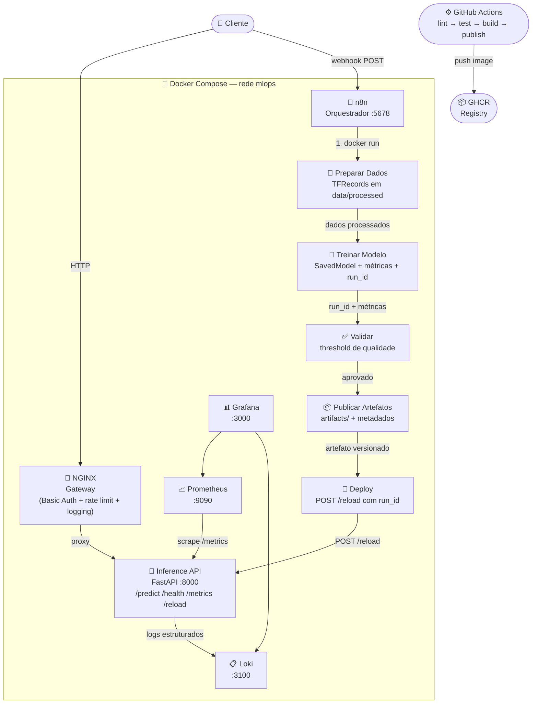

# 🌐 MLOps Challenge Starter — Neural Machine Translation (EN → PT)

Repositório inicial (**starter kit**) para o desafio de MLOps. Contém as rotinas base de preparação de dados, treinamento e inferência para um modelo de tradução automática Inglês -> Português, utilizando um **Transformer** customizado com TensorFlow/Keras.

> **O objetivo do candidato é construir a automação end-to-end (CI/CD, orquestração, monitoramento, etc.) em cima destas rotinas já fornecidas.**
>
> 📄 **Consulte a especificação completa do desafio em [CHALLENGE.md](CHALLENGE.md).**

---

## 📋 Visão Geral

Este repositório fornece as **rotinas base** que o candidato utilizará para implementar a automação MLOps. As peças já inclusas são:

| Componente | Descrição |
|---|---|
| **Preparação de Dados** | Download e tokenização do dataset [ParaCrawl EN-PT](https://www.paracrawl.eu/) via TensorFlow Datasets, exportando TFRecords prontos para treino |
| **Treinamento** | Modelo Transformer (encoder-decoder) com warmup schedule, masked loss/accuracy e versionamento automático de artefatos |
| **Inference API** | API REST (FastAPI + Uvicorn) para tradução em tempo real, com métricas, health check e hot-reload de modelos |
| **Testes** | Suite de testes de contrato da API via Pytest + HTTPX |

> [!IMPORTANT]
> Estas rotinas já funcionam individualmente via Docker Compose. O desafio consiste em **automatizar e orquestrar** todo o ciclo de vida do modelo de ponta a ponta.

---

## 🏗️ Arquitetura

```
mlops_challenge_starter/
├── ml/                        # Pipeline de ML
│   ├── common.py              # Utilitários (I/O JSON, hashing, run_id)
│   ├── tokenizers.py          # Download e carregamento de tokenizers
│   ├── prepare_dataset.py     # Preparação do dataset (TFRecords)
│   ├── model.py               # Transformer (Encoder/Decoder/Positional Encoding)
│   └── train.py               # Loop de treino, exportação de SavedModel
│
├── inference_api/             # API de inferência
│   ├── main.py                # Endpoints FastAPI
│   ├── model_manager.py       # Gerenciamento thread-safe do SavedModel
│   ├── schemas.py             # Schemas Pydantic (request/response)
│   ├── metrics.py             # Contadores de métricas da aplicação
│   └── logging_config.py      # Configuração de logging estruturado
│
├── tests/                     # Testes automatizados
│   └── test_api_contract.py   # Testes de contrato dos endpoints
│
├── data/                      # Dados processados (gerados)
├── artifacts/                 # Artefatos de treino (SavedModel, configs)
├── Dockerfile                 # Imagem base (Python 3.11-slim)
├── docker-compose.yml         # Orquestração de todos os serviços
└── requirements.txt           # Dependências Python
```

---

## 🧠 Modelo

O modelo é um **Transformer** com arquitetura encoder-decoder implementado do zero:

- **Positional Encoding** — codificação posicional sinusoidal
- **Encoder** — camadas com Multi-Head Attention + FFN + Layer Norm + Dropout
- **Decoder** — camadas com Self-Attention + Cross-Attention + FFN + Layer Norm
- **Learning Rate Schedule** — warmup linear seguido de decaimento inverso (baseado no paper *Attention Is All You Need*)

### Hiperparâmetros padrão

| Parâmetro | Valor |
|---|---|
| `num_layers` | 4 |
| `d_model` | 128 |
| `num_heads` | 4 |
| `dff` | 512 |
| `dropout` | 0.1 |
| `max_tokens` | 64 |

---

## 🚀 Executando as Rotinas (Quick Start)

As rotinas podem ser executadas individualmente com Docker Compose usando **profiles**.

### Pré-requisitos

- [Docker](https://docs.docker.com/get-docker/) e [Docker Compose](https://docs.docker.com/compose/install/)

### 1. Preparar o Dataset

```bash
docker compose --profile prepare up --build
```

Baixa o dataset ParaCrawl EN-PT, tokeniza e gera TFRecords em `data/processed/`.

**Variáveis opcionais:**

| Variável | Padrão | Descrição |
|---|---|---|
| `DATASET_NAME` | `para_crawl/enpt` | Dataset do TFDS |
| `MAX_TOKENS` | `64` | Máximo de tokens por sentença |
| `TRAIN_RECORDS` | `5000` | Amostras de treino |
| `VAL_RECORDS` | `500` | Amostras de validação |
| `SEED` | `42` | Seed de reprodutibilidade |

### 2. Treinar o Modelo

```bash
docker compose --profile train up
```

Treina o Transformer e exporta o SavedModel versionado em `artifacts/<run_id>/`.

**Variáveis opcionais:**

| Variável | Padrão | Descrição |
|---|---|---|
| `EPOCHS` | `5` | Número de épocas |
| `BATCH_SIZE` | `32` | Tamanho do batch |
| `THRESHOLD` | `0.30` | Threshold de qualidade |
| `GIT_SHA` | `unknown` | SHA do commit para rastreabilidade |

### 3. Iniciar a API de Inferência

```bash
docker compose --profile api up
```

A API estará disponível em **http://localhost:8000**.

> **Dica:** Para especificar um modelo, defina `DEFAULT_RUN_ID=<run_id>`.

### 4. Executar os Testes

```bash
docker compose --profile tests up
```

---

## 📡 Endpoints da API

| Método | Rota | Descrição                                                          |
|---|---|--------------------------------------------------------------------|
| `GET` | `/health` | Health check — status, `run_id` e `model_loaded`                   |
| `GET` | `/model` | Retorna o `run_id` do modelo ativo                                 |
| `GET` | `/metrics` | Contadores: `requests_total`, `errors_total`, `translations_total` |
| `POST` | `/predict` | Traduz texto EN → PT                                               |
| `POST` | `/reload` | Hot-reload de modelo por `run_id` ou `artifacts_dir`               |
| `GET` | `/docs` | Documentação interativa (Swagger UI)                               |

### Exemplo — `/predict`

**Request:**
```bash
curl -X POST http://localhost:8000/predict \
  -H "Content-Type: application/json" \
  -d '{"text": "Olá, como vai você?"}'
```

**Response:**
```json
{
  "translation": "Hello, how are you?",
  "run_id": "nmt_20260225T130027Z_ap5vq0",
  "latency_ms": 42.5
}
```

---

## ⚙️ Variáveis de Ambiente (API)

| Variável | Padrão | Descrição |
|---|---|---|
| `ARTIFACTS_DIR` | `artifacts` | Diretório raiz dos artefatos |
| `DEFAULT_RUN_ID` | *(vazio)* | `run_id` do modelo a carregar na inicialização |
| `API_PORT` | `8000` | Porta exposta pelo Docker |

---

## 🧪 Testes

Os testes de contrato validam:

- ✅ `/health` retorna `200` com `status`, `run_id` e `model_loaded`
- ✅ `/predict` retorna `503`/`500` sem modelo carregado
- ✅ `/predict` valida texto vazio (`422`) e texto acima de 512 caracteres (`422`)
- ✅ `/metrics` retorna os três contadores como inteiros
- ✅ `/metrics` incrementa corretamente após chamadas de `/predict`
- ✅ `/model` retorna o campo `run_id`

---

## 🛠️ Stack Tecnológica

| Tecnologia | Uso |
|---|---|
| **Python 3.11** | Linguagem principal |
| **TensorFlow 2.20** | Framework de ML (modelo + servindo) |
| **TensorFlow Text 2.20** | Tokenização |
| **TensorFlow Datasets** | Download do dataset ParaCrawl |
| **FastAPI** | Framework da API REST |
| **Uvicorn** | Servidor ASGI |
| **Pytest + HTTPX** | Testes automatizados |
| **Docker / Docker Compose** | Containerização e orquestração |

---

## 🗺️ Diagrama de Arquitetura



---

## 🏗️ Infraestrutura Adicionada

| Componente | Tecnologia | Função |
|---|---|---|
| **Orquestrador** | n8n | Pipeline ML via webhook |
| **API Gateway** | NGINX | Basic Auth, rate limit e logging |
| **Métricas** | Prometheus + Grafana | Coleta e dashboard |
| **Logs** | Loki + Grafana | Centralização de logs |
| **CI/CD** | GitHub Actions | Lint, test, build, publish |

---

## 🚀 Executando o Ambiente Completo

### Pré-requisitos

- Docker e Docker Compose
- Arquivo `.env` configurado a partir de `.env.example`
- Arquivo `nginx/.htpasswd` configurado a partir de `nginx/.htpasswd.example`

### 1. Subir todos os serviços

```bash
docker compose --profile api up -d --build
```

| Serviço | URL |
|---|---|
| API (via NGINX) | http://localhost |
| n8n | http://localhost:5678 |
| Grafana | http://localhost:3000 |
| Prometheus | http://localhost:9090 |
| Loki readiness | http://localhost:3100/ready |

### 2. Disparar o pipeline via webhook

```bash
curl -X POST http://localhost:5678/webhook/mlops-pipeline \
  -H "Content-Type: application/json" \
  -d '{
    "dataset_name": "para_crawl/enpt",
    "max_tokens": 64,
    "epochs": 10,
    "threshold": 0.30,
    "git_sha": "abc1234"
  }'
```

O pipeline executa automaticamente: **Preparar Dados → Treinar → Validar → Deploy**.

### 3. Autenticação na API

A API está protegida por Basic Auth via NGINX. Use as credenciais configuradas no seu arquivo local `nginx/.htpasswd`:

```bash
curl -u admin:admin http://localhost/health
```

Para encerrar a stack do ambiente completo:

```bash
docker compose --profile api down --remove-orphans
```

---

## 📊 Observabilidade

- **Grafana** — acesse http://localhost:3000 (usuário: `admin`, senha: definida em `GF_ADMIN_PASSWORD`)
- Datasources provisionados automaticamente: Prometheus e Loki
- Métricas da API disponíveis em `/metrics` e coletadas pelo Prometheus a cada 15s
- Logs e controle de acesso da API passam pelo NGINX, com `Basic Auth`, `limit_req` de `30r/m` por cliente e `access_log` em JSON

---

## 🔄 CI/CD

Pipeline GitHub Actions com 4 stages em sequência:

| Stage | Gatilho | Ação |
|---|---|---|
| **lint** | push/PR | `ruff check` em `ml/`, `inference_api/`, `tests/` |
| **test** | após lint | `pytest -q` |
| **build** | após test | `docker build` |
| **publish** | apenas `main` | push para GHCR |

---

## 🔐 Variáveis de Ambiente

> [!WARNING]
> Não versione arquivos reais com credenciais. O repositório inclui `.env.example` e `nginx/.htpasswd.example` como templates locais, enquanto `.env`, `nginx/.htpasswd` e arquivos temporários/bancos locais ficam ignorados por `.gitignore`.

| Variável | Padrão | Descrição |
|---|---|---|
| `N8N_USER` | `admin` | Usuário do n8n |
| `N8N_PASSWORD` | `change-me` | Senha do n8n |
| `GF_ADMIN_PASSWORD` | `change-me` | Senha do Grafana |
| `DEFAULT_RUN_ID` | *(vazio)* | `run_id` do modelo carregado na inicialização da API |
| `ARTIFACTS_DIR` | `artifacts` | Diretório de artefatos montado na API |
